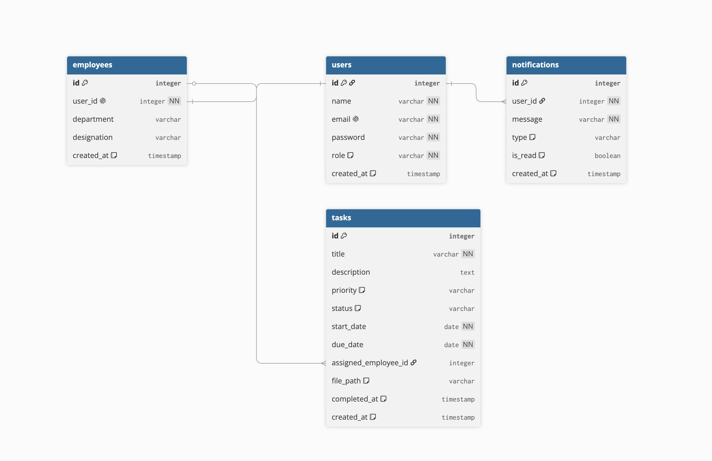

# TaskFlow - Employee & Task Management System

## Project Overview

TaskFlow is a modern, responsive full-stack application designed to manage employees and their daily tasks efficiently. The platform features robust role-based access control, real-time notifications, dynamic file uploads, report generation, and interactive data visualizations. 

Built with **React (Vite), TypeScript, Tailwind CSS, and Shadcn UI** on the frontend, and a highly scalable **Node.js, Express, and MySQL** backend, TaskFlow guarantees a premium, lightning-fast user experience.

---

## Application Architecture & Flow

The diagram below illustrates the high-level flow of data and requests through the TaskFlow system.

```mermaid
graph TB
    subgraph Client_Layer ["Client Layer"]
        User["User (Admin / Employee)"]
    end

    subgraph Presentation_Layer ["Presentation Layer"]
        UI["React Frontend (Vite, Tailwind, Shadcn)"]
    end

    subgraph Application_Layer ["Application Layer (Node.js + Express)"]
        Router["API Router & Auth Middleware"]
        subgraph Controllers ["Controllers"]
            AuthCtrl["Auth Controller"]
            TaskCtrl["Task Controller"]
            EmpCtrl["Employee Controller"]
            RepCtrl["Report Controller"]
        end
    end

    subgraph Data_Layer ["Data Layer"]
        DB[("MySQL Database")]
    end

    User -->|Interacts via Browser| UI
    UI -->|REST API (JSON & Multipart)| Router
    Router --> AuthCtrl
    Router --> TaskCtrl
    Router --> EmpCtrl
    Router --> RepCtrl
    
    AuthCtrl -->|SQL Queries| DB
    TaskCtrl -->|SQL Queries| DB
    EmpCtrl -->|SQL Queries| DB
    RepCtrl -->|SQL Queries| DB

    classDef layerStyle fill:#f8f9fa,stroke:#d1d5db,stroke-width:2px,color:#1f2937,stroke-dasharray: 5 5
    class Client_Layer,Presentation_Layer,Application_Layer,Data_Layer layerStyle
    
    classDef nodeStyle fill:#ffffff,stroke:#9ca3af,stroke-width:2px,color:#111827
    class User,UI,Router,AuthCtrl,TaskCtrl,EmpCtrl,RepCtrl,DB nodeStyle
```

---

## Installation Process

There are multiple ways to run TaskFlow locally. You can use the automated startup script, spin everything up with Docker, or run it manually.

### Option 1: Automated Script (Recommended for Local Dev)
We have provided an automated bash script that will install all dependencies for both the frontend and backend, and start both development servers concurrently.

```bash
# Ensure the script is executable
chmod +x bash.sh

# Run the setup script
./bash.sh
```
*Note: Make sure your MySQL database is running and the `.env` file is properly configured with your DB credentials before running.*

### Option 2: Docker Containerization
If you prefer not to manage local Node versions and databases, you can spin up the entire isolated environment (Frontend Nginx Server, Backend API, and MySQL Database) using Docker Compose.

```bash
# Build and start all services in detached mode
docker compose up -d --build
```
The application will automatically initialize the database schema and be available at `http://localhost`.

### Option 3: Manual Installation
```bash
# 1. Install and Start Backend
cd backend
npm install
npm run dev

# 2. Install and Start Frontend (In a new terminal window)
cd ..
npm install
npm run dev
```

---

## Features & Role-Based Access Control (RBAC)

TaskFlow features strict segregation of duties between **Admins** and standard **Employees**.

| Feature / Capability | Admin | Employee |
| :--- | :---: | :---: |
| **Authentication** | Register / Login | Register / Login |
| **Dashboard** | Full system overview & company stats | Personal overview & assigned task stats |
| **Employee Management** | Create, View, Update, Delete Employees | View colleague profiles only |
| **Task Management** | Create, Assign, Edit, Delete all tasks | Update status and attach files to assigned tasks |
| **Notifications** | Receives alerts when tasks are completed | Receives alerts when assigned a new task |
| **Report Generation** | Export CSV/Excel for ALL company tasks | Export CSV/Excel for assigned tasks only |
| **API Documentation** | Access to `/api-docs` Swagger UI | Access to `/api-docs` Swagger UI |

---

## Database Schema Structure

The application's relational data is structured to optimize fast querying and maintain strict referential integrity.



---

## Testing and API Documentation

- **Interactive API Docs (Swagger):** With the backend running, visit `http://localhost:5001/api-docs` to interactively explore and test all API routes.
- **Backend Unit Tests:** Run `npm test` inside the `/backend` directory (Uses Jest + Supertest).
- **Frontend Unit Tests:** Run `npm test` in the root directory (Uses Vitest + React Testing Library).
